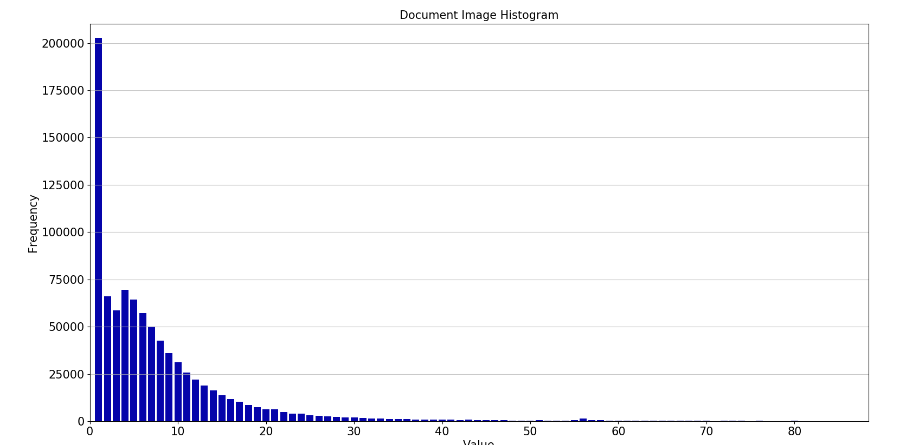

## Đồ thị histogram của dataset theo độ dài của comment (số lượng words)

Thu được khi chay file histogram.py
```
python3 -m pip install -r requirements.txt
python3 histogram.py

```



    - Tổng lượng comment: 883510.
    - Comment có độ dài tối đa là 1698

## File dữ liệu: comments.csv 
Số lương comment 883510
- Địng dạng csv tối ưu cho xử lý dữ liệu lớn, giúp tăng tốc xử lý của máy tính
- chứa toàn bọ tất cả 900k comments, mỗi comment là 1 row, 
- row đầu tiên là header, bỏ đi khi read
- định dạng uft-16


Để đọc dữ liệu từ file
```
import csv

with open('comments.csv', 'r', encoding='utf-16') as file:
    reader = csv.reader( (line.replace('\0','') for line in file) )
    for row in reader:
        print(row)
```
- Có thể dùng pandas để tăng tốc xử 


## File dữ liệu sau khi loại bỏ các comment NULL/Empty: comments_1.csv 

Số lượng comment giảm còn 811104

```
python3 remove_null.py
```

## File dữ liệu sau khi loại bỏ các comment bị duplicated : comments_2.csv 

Số lượng comment giảm còn 489709 :))

```
python3 remove_duplicates.py
```

## File dữ liệu sau khi chuẩn hóa: chuyển về lowercase, : comments_3.csv

```
python3 to_lowercase.py
```

### TODO List.
- [x] Vẽ đồ thì histogram của dữ liệu.
- [x] Chuyển dữ liệu về 1 file địng dạng csv.
- [ ] Chuẩn hóa, làm sạch dữ liệu.
- [ ] Thử nghiệm các mô hình
- [ ] So sánh chọn mô hình
- [ ] Xây dựng trang web hiển thị kết quả phân tích
- [ ] Tích hợp hệ thống


# Referencies
1. Xây dựng mô hình không gian vector cho Tiếng Việt
https://viblo.asia/p/xay-dung-mo-hinh-khong-gian-vector-cho-tieng-viet-GrLZDXr2Zk0

2. Phân tích phản hồi khách hàng hiệu quả với Machine learning(Vietnamese Sentiment Analysis)

https://viblo.asia/p/phan-tich-phan-hoi-khach-hang-hieu-qua-voi-machine-learningvietnamese-sentiment-analysis-Eb85opXOK2G